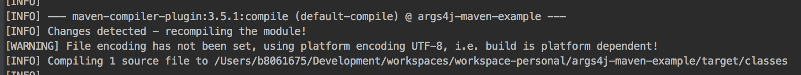
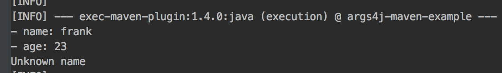
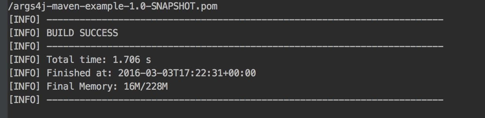
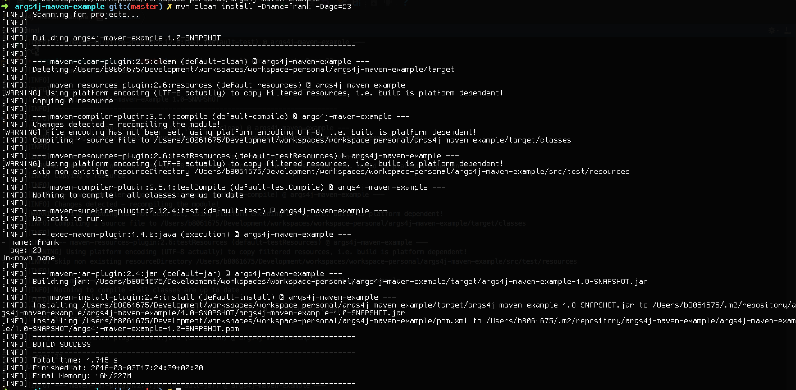

#Introduction

This is me messing around with args4j library. This allows you to parse commands via the command line.

This messing around also includes delving into the world of maven plugins.

###This is WIP:

###Without the exec-maven-plugin in the pom.xml

Prior to me adding the 'exec-maven-plugin' in the pom.xml file, in order to parse the arguments, I needed to first:

1) Run: 

```sh
$ mvn compile
```

2) On the command line, I then did this...

```sh
$ mvn exec:java -Dexec.mainClass="com.richard.Main" -Dexec.arguments=-name=richard,-age=12
```

**NOTE:**

mvn exec:java -Dexec.mainClass="com.richard.Main" -Dexec.args=-name=richard,-age=12 DID NOT WORK. 

The maven build was a success but 'name' was assigned both parsed arguments:

> name: richard,-age=12
> age: null

###With the exec-maven-plugin in the pom.xml (but without the executions section)

           <plugin>
                <groupId>org.codehaus.mojo</groupId>
                <artifactId>exec-maven-plugin</artifactId>
                <version>1.4.0</version>
                <configuration>
                    <mainClass>com.richard.Main</mainClass>
                    <arguments>
                        <argument>-name</argument>
                        <argument>${name}</argument>
                        <argument>-age</argument>
                        <argument>${age}</argument>
                    </arguments>
                    <!--Instead of arguments, I could've also used the commandLineArgs option too - see below-->
                    <!--But args is a little nicer to read-->
                    <!--<commandlineArgs>-name ${name} -age ${age}</commandlineArgs>-->
                </configuration>
            </plugin>
            
1) Run:

```sh
$ mvn compile
```

2) On the command line, I can then do...

```sh
$ mvn exec:java -Dname=roger -Dage=43
```

...and the following is printed

> name: roger
> age: 54
> Unknown name


###With the mvn-compiler-plugin in the pom.xml

So I've now added the compiler plugin in the pom.xml:

            <plugin>
                <groupId>org.apache.maven.plugins</groupId>
                <artifactId>maven-compiler-plugin</artifactId>
                <version>3.5.1</version>
                <configuration>
                    <source>1.7</source>
                    <target>1.7</target>
                </configuration>
            </plugin>
           
This plugin runs during maven's compile phase and compiles both the main source files AND the test source files.
I don't need to put in any execution information within this plugin because by default, it will run as part of the compile phase 

See below for more detail:
https://maven.apache.org/plugins/maven-compiler-plugin/usage.html


###With the exec-maven-plugin in the pom.xml (including the executions section)

So my exec-maven-plugin now looks like this:

           <plugin>
                <groupId>org.codehaus.mojo</groupId>
                <artifactId>exec-maven-plugin</artifactId>
                <version>1.4.0</version>
                <executions>
                    <execution>
                        <id>execution</id>
                        <phase>test</phase>
                        <goals>
                            <goal>java</goal>
                        </goals>
                    </execution>
                </executions>
                <configuration>
                    <mainClass>com.richard.Main</mainClass>
                    <arguments>
                        <argument>-name</argument>
                        <argument>${name}</argument>
                        <argument>-age</argument>
                        <argument>${age}</argument>
                    </arguments>
                    <!--Instead of arguments, I could've also used the commandLineArgs option too - see below-->
                    <!--But args is a little nicer to read-->
                    <!--<commandlineArgs>-name ${name} -age ${age}</commandlineArgs>-->
                </configuration>
            </plugin>

To clarify, the maven-compiler plugin AND maven-exec-plugin are now installed. So now, I can actually run a:

```sh
$ mvn clean install -Dname=frank -Dage=23
```

...and this will work! 

I can see that the maven compiler plugin is now being run:



...and I can see that the exec plugin is also being run:



...and the build is marked as a success!




**HOWEVER** I don't quite understand the maven lifecycle well enough...

I'm a little unsure as to the whether the phase/execution goal of the maven-exec-plugin is correct. I'm a little unsure
as to what is best. 

###So NEXT STEPS:
 
1) Figure out whether the exec-plugin actually NEEDS me to specify a phase...

2) Start looking at the maven surefire and maven failsafe plugins - what is the difference between these and the exec one...?
When should i use one and not the other? What is a tester more likely to use?

Do i actually need to use the exec plugin at all (to run tests?). THINK ABOUT IT - the shopping test framework DOESN'T
use the exec-plugin (but then again it doesn't have a main method...)....mmmmmm...it uses the failsafe-plugin...
need to read up about this...

Beccy's repo ONLY uses the exec plugin and that DOESN'T have a main method. Instead it uses @Test annotation:

https://github.com/DigitalInnovation/data_checker
But then again, i think I could run that with just a mvn clean install (i.e. i don't think it needs the exec-plugin)

Interesting...look at the ordering of the maven plugins during my mvn clean install above...

I have added the maven-compiler-plugin in my pom.xml because if i don't, the source and target = 1.5
(https://maven.apache.org/plugins/maven-compiler-plugin/)



3) Understand Maven profiles in more detail too:
http://www.tutorialspoint.com/maven/maven_build_profiles.htm


###Websites I've used so far:

- http://args4j.kohsuke.org/sample.html
- http://www.vineetmanohar.com/2009/11/3-ways-to-run-java-main-from-maven/
- http://stackoverflow.com/questions/1200054/java-library-for-parsing-command-line-parameters
- http://www.mojohaus.org/exec-maven-plugin/usage.html
- https://redstack.wordpress.com/2010/12/22/configuring-maven-to-run-your-java-application/
- http://stackoverflow.com/questions/5396749/pass-command-line-params-in-mvn-execexec